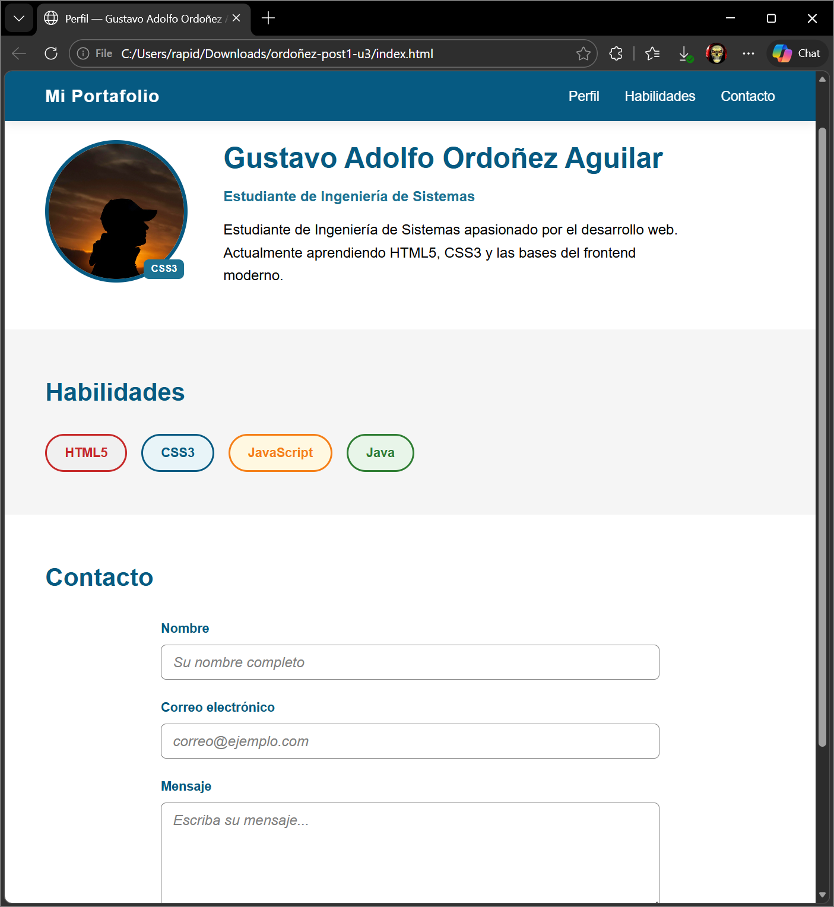

# ordoñez-post1-u3 — Unidad 3: CSS3 Básico

## Nombre del Estudiante
**Gustavo Adolfo Ordoñez Aguilar**  
Ingeniería de Sistemas — Programación Web 2026

---

## Descripción del Proyecto

Página web de perfil personal desarrollada como laboratorio de la **Unidad 3: CSS3 Básico** de la asignatura Programación Web (UDES).

El proyecto aplica de forma integrada:
- Selectores CSS avanzados (descendente, hijo directo, atributo, pseudo-clases)
- Box Model con `box-sizing: border-box`
- Posicionamiento CSS: `fixed` (header), `relative`/`absolute` (badge sobre avatar)
- Estilos de formulario accesibles con estados `:focus` y `:hover`
- CSS Custom Properties (variables) y nomenclatura BEM
- HTML5 semántico: `header`, `main`, `section`, `form`, `footer`

---

## Estructura del Proyecto

```
ordoñez-post1-u3/
├── index.html          # Estructura HTML5 semántica
├── css/
│   └── estilos.css     # Estilos CSS3 completos
├── img/
│   └── perfil.jpg      # Foto de perfil
└── README.md           # Este archivo
```


---

## Captura de Pantalla



---

## Funcionalidades Implementadas

| Característica | Implementación |
|---|---|
| Header fijo | `position: fixed` con `z-index: 100` |
| Badge sobre avatar | `position: absolute` dentro de contexto `relative` |
| Hover en skills | `transform: translateY(-2px)` |
| Focus accesible | `box-shadow: 0 0 0 3px rgba(6,90,130,0.2)` |
| Box Model global | `box-sizing: border-box` en reset universal |
| Variables CSS | Custom Properties en `:root` |
| Nomenclatura BEM | `.skill-item--html`, `.skill-item--css`, etc. |

---

*Programación Web — Ingeniería de Sistemas — UDES 2026*
